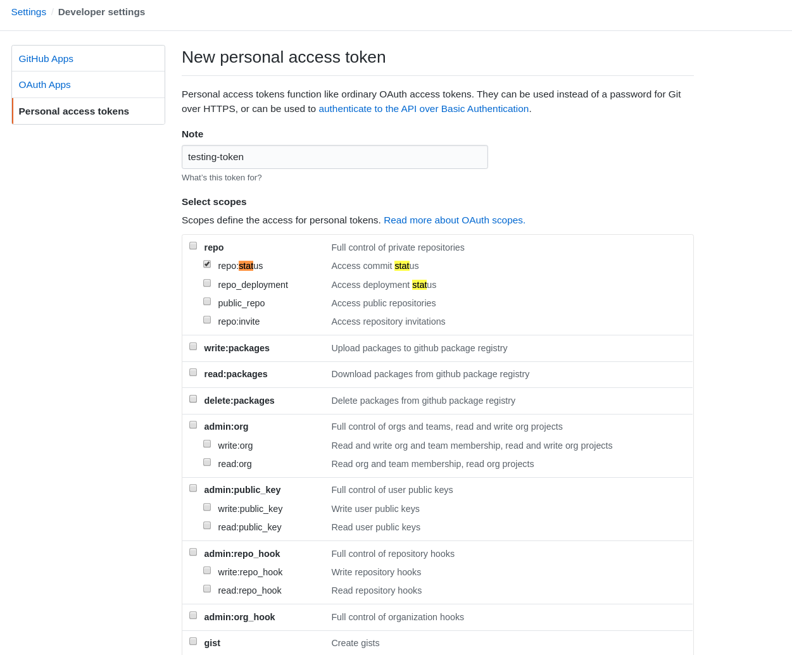

# Setting up to Push GitHub commit-statuses

## Prerequisites

You'll need this operator, and Tekton installed see the installation
[instructions](../README.md#installing).

And you'll need a GitHub auth token.

## Create a secret

Create a secret from your GitHub auth token, this command assumes a token is in `~/Downloads/token`.

Visit https://github.com/settings/tokens/new and create a new personal token:



You'll need to enable the `repo:status` scope.

Click to generate the token, and use the following command to write it to a
file:

```shell
$ echo -n <paste token> > $HOME/Downloads/token
```

```shell
$ kubectl create secret generic github-auth --from-file=$HOME/Downloads/token
```

## Annotating a PipelineRun

The operator watches for PipelineRuns with specific annotations.

This is an alpha operator, and the annotation names will likely change, but for now
you'll need...

```yaml
apiVersion: tekton.dev/v1alpha1
kind: PipelineRun
metadata:
  name: demo-pipeline-run
  annotations:
    "tekton.dev/git-status": "true"
    "tekton.dev/status-context": "demo-pipeline"
    "tekton.dev/status-description": "this is a test"
spec:
  pipelineRef:
    name: demo-pipeline
  serviceAccountName: 'default'
  resources:
  - name: source
    resourceSpec:
      type: git
      params:
        - name: revision
          value: insert revision
        - name: url
          value: https://github.com/this/repo
```

The revision here should be the full commit SHA from the HEAD of a branch associated with a Pull Request.

The annotations are:

<table style="width=100%" border="1">
  <tr>
    <th>Name</th>
    <th>Description</th>
    <th>Required</th>
    <th>Default</th>
  </tr>
  <tr>
    <th>
      tekton.dev/git-status
    </th>
    <td>
      This indicates that this <code>PipelineRun</code> should trigger commit-status notifications.
    </td>
    <td><b>Yes</b></td>
    <td></td>
  </tr>
  <tr>
    <th>
      tekton.dev/status-context
    </th>
    <td>
      This is the <a href="https://developer.github.com/v3/repos/statuses/#create-a-status">context</a> that will be reported, you can require named contexts in your branch protection rules.
    </td>
    <td>No</td>
    <td>"default"</td>
  </tr>
  <tr>
    <th>
      tekton.dev/status-description
    </th>
    <td>
      This is used as the description of the context, not the commit.
    </td>
    <td>No</td>
    <td>""</td>
  </tr>
  <tr>
    <th>
     tekton.dev/status-target-url
    </th>
    <td>
      If provided, then this will be linked in the GitHub web UI, this could be used to link to logs or output.
    </td>
    <td>No</td>
    <td>""</td>
  </tr>
</table>

## Detecting the Git Repository

Currently, this uses a simple mechanism to find the Git repository and SHA to update the status of.

It looks for a single `PipelineResource` of type `git` and pulls the *url* and *revision* from there.

If no suitable `PipelineResource` is found, then this will be logged as an
error, and _not_ retried.

It'd be fairly trivial to fallback to an annotation for the repo and SHA.

## Execution

The easiest way to see this in action, is to create a Pull Request against a Git
Repository.

Create a [git resource](https://github.com/tektoncd/pipeline/blob/master/docs/resources.md#git-resource) and set the revision to the SHA of the Pull Request (the head commit).

Execute the `PipelineRun` and view the PR, and the status should be reported.

## Example files

There are a complete set of resources in the [examples](./examples) directory.

NOTE: **You must replace the Repository and SHA entries in the example PipelineRun**

## FAQ

 1. Does this work with `resourceRef`
    *Not yet, this is definitely on my TODO list*.
 1. Can this pull the repository details from a `pullrequest`
    `PipelineResource`?
    *Not yet, again, this is on my TODO list*.
 1. Why don'ty you use labels instead of annotations?
    *Labels can't contain spaces, which are useful in descriptions*
